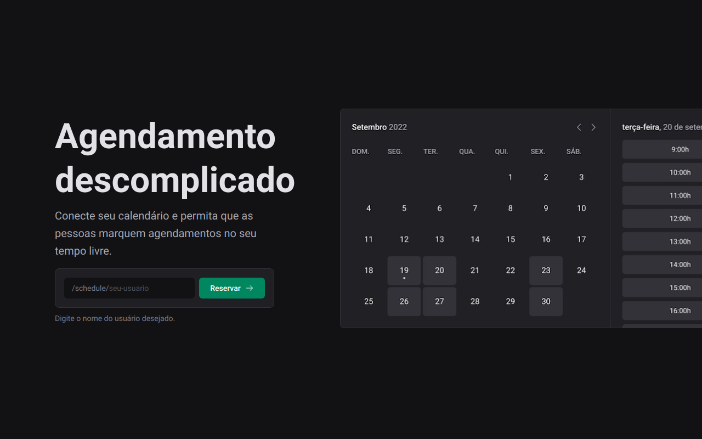

<p align="center">
  
</p>

<p align="center">
  <a href="#-technologies">Technologies</a>&nbsp;&nbsp;&nbsp;|&nbsp;&nbsp;&nbsp;
  <a href="#-project">Project</a>&nbsp;&nbsp;&nbsp;|&nbsp;&nbsp;&nbsp;
  <a href="#-screenshot">Screenshot</a>&nbsp;&nbsp;&nbsp;|&nbsp;&nbsp;&nbsp;
  <a href="#-how-to-run">How to run</a>&nbsp;&nbsp;&nbsp;|&nbsp;&nbsp;&nbsp;
  <a href="#-license">License</a>
</p>

<p align="center">
  
</p>

<br>

## 🧪 Technologies

This project was developed with the following technologies:

- [React](https://reactjs.org)
- [TypeScript](https://www.typescriptlang.org/)
- [Prisma](https://www.prisma.io/)
- [React Query](https://react-query-v3.tanstack.com/)
- [PlanetScale](https://planetscale.com/)

## 🍺 Project

The Ignite Call project enables individuals to schedule appointments with you during your available hours. By integrating with your Google Calendar, the app displays your open time slots and allows users to schedule appointments, which will provide a link for a Google Meet call.

You can check appointment app in [here](https://05-ignite-call.vercel.app/).

This project was deployed on Vercel and it's database on PlanetScale.

## 🖼 Screenshot

<p align="center">
  
</p>

## 🚀 How to run

Clone the project and access its folder.

```bash
$ git clone https://github.com/thefalked/05-ignite-call.git
$ cd 05-ignite-call
```

To start it, follow the steps below:

```bash
# Install dependencies
$ npm run dev

# Start the project
$ npm run dev
```

## 📝 License

This project is under the MIT license. See the [LICENSE](LICENSE) file for more details.
